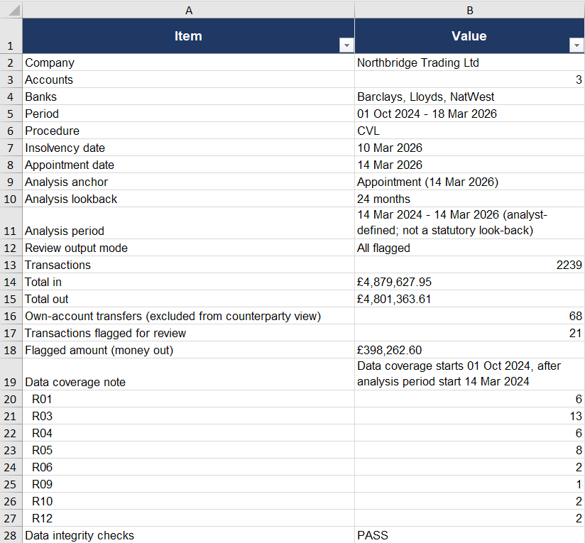
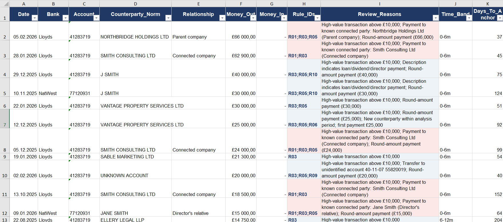
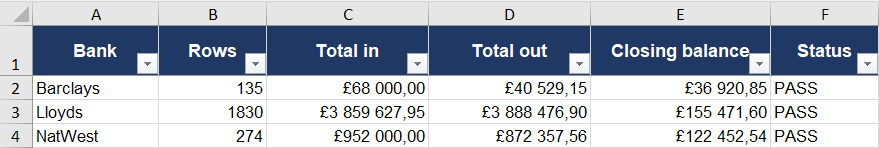

# Insolvency Transaction Review Toolkit

**Bank statement normalisation and transaction review workflow for insolvency and forensic analysis.**

This repository shows, on a fully synthetic case, how I approach the analytical part of an insolvency investigation: take bank statements from an insolvent company across different bank layouts, bring them into one traceable transaction register, and screen them so that the practitioner's time goes to the transactions that require further investigation, rather than reformatting spreadsheets.

> Portfolio and evaluation purposes only. No real company, person or bank data is used. No permission is granted to reuse or redistribute the code. The screening rules here are analytical heuristics; legal characterisation of any transaction (preference, transaction at undervalue, etc.) is a matter for the insolvency practitioner and legal advisers.

---

## The problem this addresses

An appointed practitioner receives statements from several banks and accounts, each with its own layout (the toolkit starts once statements are available as CSV or XLSX): a single signed `Amount` in one bank, `Money In / Money Out` in another, `Paid In / Paid Out` in a third, preamble rows above the header, running balances in different places. Before any investigation can start, someone has to consolidate that into one register, work out who the counterparties are, separate transfers between the company's own accounts, and only then look for what matters: payments to connected parties, cash withdrawals, new payees shortly before insolvency, transfers to unidentified accounts, anything dated after the appointment.

Done by hand, this takes days per case and is hard to evidence. This toolkit makes it reproducible and traceable: every figure in the output points back to the source file and row it came from.

## Pipeline

```
bank statements (CSV / XLSX - three UK-style layouts in this version)
        │
        ▼
 Layer 1 - Normalisation
   detect header row · detect amount scheme · standardise dates & amounts
   extract counterparty from description · identify own-account transfers
   keep Balance / Type / Reference · Source_File + Source_Row on every row
   integrity check: rows, total in, total out, closing balance per statement
        │
        ▼
 Layer 2 - Review (screening heuristics)
   case_config.xlsx: dates, analysis period, known parties, thresholds
   8 rules, each writes a reason; several rules can flag one transaction
        │
        ▼
 review_output.xlsx
   Case_Summary · Review_Items · Counterparty_Summary · Transactions · Integrity
   (full expected/actual reconciliation retained in hidden Integrity_Detail)
```

## Synthetic case: Northbridge Trading Ltd (fictional)

18 months of trading, three accounts at three banks, in synthetic UK-style layouts modelled on common Lloyds, NatWest and Barclays statement exports (Lloyds-style CSV with a single signed amount, NatWest-style XLSX with Money In / Money Out, Barclays-style CSV with Paid In / Paid Out), receipts declining from September 2025, insolvency date 10 March 2026, appointment 14 March 2026. 2,239 transactions. 21 review items were planted in the data with a ground-truth file (`synthetic/data/expected_flags.csv`) so that every rule is validated against expected test cases.

**Result on the synthetic case:** 21 of 21 planted items flagged; no other transactions flagged; data integrity checks pass for all three statements (rows, totals and closing balances match the generator's control totals). Real statements are noisier than a synthetic case, and thresholds are meant to be tuned per engagement. The point here is that the mechanism is transparent and testable.

| | |
|---|---|
| Transactions | 2,239 across 3 accounts |
| Own-account transfers identified and excluded from counterparty view | 68 |
| Flagged for review | 21 transactions, £398,262.60 money out |
| Paid to known connected parties (flagged) | £190,400 |
| Cash withdrawals above threshold in the final weeks | 6 (£14,000) |
| Analysis period (demo) | 24 months before Appointment: 14 Mar 2024 to 14 Mar 2026 (data coverage from 01 Oct 2024 is noted in Case_Summary) |
| Data integrity checks | PASS |


### Output preview

**Case summary**



**Flagged transactions - selected rows from `Review_Items`**



**Integrity checks**

The visible `Integrity` sheet is a compact practitioner view. The full expected/actual reconciliation is retained in the hidden `Integrity_Detail` sheet.




## What the review flags look like

Each flagged transaction carries every reason that applies, so the practitioner sees why it was surfaced rather than a single label:

| Date | Counterparty | Relationship | Money out | Rules | Reasons |
|---|---|---|---|---|---|
| 05 Feb 2026 | Northbridge Holdings Ltd | Parent company | £66,000 | R01; R03; R05 | Payment to known connected party; high-value; round amount |
| 28 Jan 2026 | Smith Consulting Ltd | Connected company | £62,900 | R01; R03 | Payment to known connected party; high-value |
| 12 Dec 2025 | Vantage Property Services Ltd | - | £25,000 | R03; R05; R06 | High-value; round amount; new counterparty within analysis period (first payment £25,000) |
| 02 Feb 2026 | *Unidentified account 40-11-07 55820019* | - | £20,000 | R03; R05; R09 | Transfer to unidentified account; high-value; round amount |
| 18 Mar 2026 | Smith Consulting Ltd | Connected company | £4,000 | R01; R12 | Post-appointment transaction - verify authority and purpose; payment to known connected party |
| 29 Dec 2025 | J SMITH | *(ambiguous - not attributed)* | £40,000 | R03; R05; R10 | Description indicates loan/dividend/director payment; high-value; round amount |

The last row illustrates a deliberate design choice: `Known_Parties` contains both John Smith (director) and Jane Smith (director's relative). A payment described as `J SMITH DIVIDEND` is **not** attributed to either person by initial. The tool does not guess identities. It is still surfaced, by the description rule (R10), for the practitioner to resolve.

## Rules in this version

| Rule | Scope | Screens for | Reason written to output |
|---|---|---|---|
| R01 | all data | Payments to parties listed in `Known_Parties` (excluding the company's own accounts) | Payment to known connected party: *name (relationship)* |
| R03 | analysis period | Money out above the high-value threshold (routine payees such as HMRC and secured lender excluded) | High-value transaction above £10,000 |
| R04 | analysis period | Cash withdrawals above threshold, or repeated withdrawals within a window | Cash withdrawal above £1,000; repeated cash withdrawals in 30 days |
| R05 | analysis period | Round-amount payments above a minimum | Round-amount payment (£25,000) |
| R06 | analysis period | First payment to a counterparty not seen in the preceding window, above a minimum | New counterparty within analysis period; first payment £12,400 |
| R09 | all data | Transfers to a sort code / account not listed as the company's own | Transfer to unidentified account 40-11-07 55820019 |
| R10 | analysis period | Descriptions containing loan / dividend / director terms | Description indicates loan/dividend/director payment |
| R12 | post-appointment | Transactions dated after the appointment date | Post-appointment transaction - verify authority and purpose |

All thresholds and the analysis period are set per case in `case_config.xlsx`.

**Analysis period.** The practitioner controls the analysis anchor and look-back period; the tool does not impose a statutory period. In `case_config.xlsx`: `Analysis_Anchor` (Appointment / Petition / Resolution / Insolvency / Custom), `Analysis_Lookback_Months` (any number of months) and an optional start override. Every transaction gets `Days_To_Anchor` and a calendar-month `Time_Band` (0-6m, 6-12m, 12-24m, 24-36m, 36m+ and post-anchor), so items can be sorted by whichever period matters for the question at hand. Connected-party and unidentified-transfer rules run on all data; the post-appointment rule runs after the appointment date; the rest run inside the analysis period. Relevant periods under UK law vary by transaction type and connection. Their legal application remains a matter for the practitioner and legal advisers.

Planned for the next version, after feedback from practitioners: counterparty concentration, payment acceleration before insolvency, refund/reversal matching, closer counterparty matching. The full category dictionaries and the more sensitive matching logic used in my own case work are not part of this public repository.

## Repository layout

```
synthetic/      generate_case.py - builds the Northbridge case, case_config.xlsx, expected_flags.csv, control_totals.csv
normalization/  normalize_statements.py - Layer 1
review/         review_engine.py - Layer 2
output/         normalized_transactions.xlsx/.csv, integrity report, review_output.xlsx
tests/          27 tests: layer 1 integrity, each rule against expected_flags.csv, exact match of flagged set to planted set, accumulation of multiple rules, analysis-period model on Appointment / Petition / Resolution / Custom anchors, start override, input validation, calendar-month time bands, review output mode
```

Run:
```
python synthetic/generate_case.py --out synthetic/data
python normalization/normalize_statements.py --input synthetic/data --config synthetic/data/case_config.xlsx --control synthetic/data/control_totals.csv --output output/normalized_transactions.xlsx --strict
python review/review_engine.py --transactions output/normalized_transactions.csv --config synthetic/data/case_config.xlsx --integrity output/normalized_transactions_integrity.csv --out output/review_output.xlsx
python -m pytest -q
```

## About

For more than ten years I have provided remote analytical support on corporate insolvency cases: financial analysis of insolvent companies, bank-statement review and identification of transactions requiring further investigation. Over time I have translated recurring analytical decisions into Python-based rules so that large transaction volumes can be consolidated, classified and screened reproducibly, allowing the practitioner to focus on transactions that require further investigation. This repository adapts part of that workflow to UK bank statement layouts on a synthetic case.

Client data is processed subject to the firm's confidentiality, data-processing and information-security requirements; work can be performed within the client's approved environment.

Irina Tokmianina · Forensic Financial Analyst | Insolvency & Transaction Review | Python · SQL · Power BI · [LinkedIn](https://linkedin.com/in/tokmianina)
